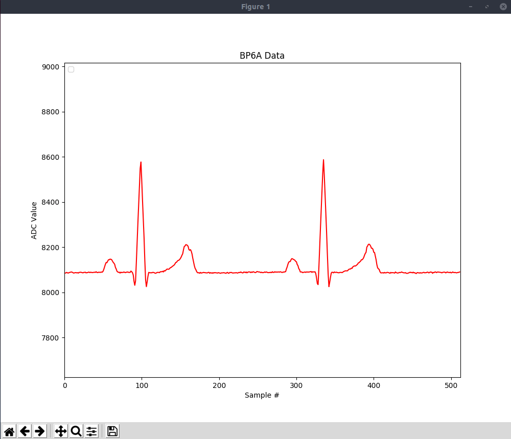
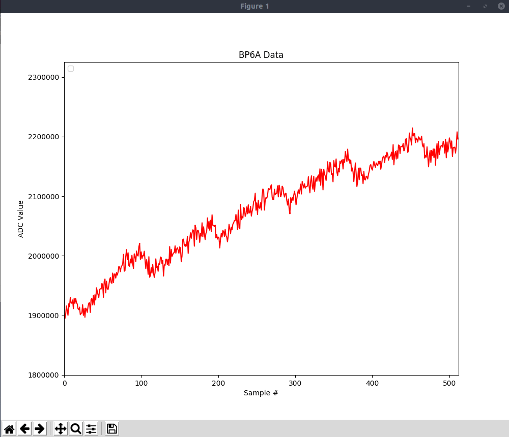

# BP6A Example

The example project is the getting started example for BP6A.
It contains ECG, PPG, BIA, and GPIO, i2c application.
You can build the project with all supported Mbed OS build tools.


## Download library & Apply patch
The example project needs [s1sbp6a_afe_lib](https://github.com/ARMmbed/mbed-bp6a_afe_lib).


*  S1SBP6A_AFE_LIB
```bash
$git clone https://github.com/ARMmbed/mbed-bp6a_afe_lib
```

## Build & Download
You can build the example.

```bash
$mbed compile  -t <TOOLCHAIN> -m S1SBP6A
```

## Expected output
The example starts show the menu you can select.

```bash
$sudo minicom /dev/ttyACM0
SIDK BP6A Example
=========   Menu   =========
   bia example  : b
   ecg example  : e
   ppg example  : p
   gpio example : g
   i2c example  : i
   stop example : q
============================
Select menu >>
```

### BIA example
This example is for Body impedance.
```bash
=========   Menu   =========
   bia example  : b
   ecg example  : e
   ppg example  : p
   gpio example : g
   i2c example  : i
   stop example : q
============================
Select menu >> b
Select menu >>BIA ExampleStart
Calibration Start
calibration r: 0, code: 849
calibration r: 1, code: 408
5653
215
170
150
142
139
142
148
157
166
175
187
195
202
209
215
221
```
### ECG example
This example is for ECG.

```bash
=========   Menu   =========
   bia example  : b
   ecg example  : e
   ppg example  : p
   gpio example : g
   i2c example  : i
   stop example : q
============================
Select menu >> e
Select menu >>ECG ExampleStart
2681
2620
2547
2553
2654
2634
2583
2543
2632
2676
2602
2555
2577
2675
2633
2564
2583
2663
2639
2579
```
You can also see the ECG data as a graph with bp6a_data_plot.py
```bash
$python  bp6a_data_plot.py -p /dev/ttyACM0
```



### PPG example
This example is for PPG.
```bash
=========   Menu   =========
   bia example  : b
   ecg example  : e
   ppg example  : p
   gpio example : g
   i2c example  : i
   stop example : q
============================
Select menu >> p
Select menu >>PPG ExampleStart
2166293
2174849
2181769
2162016
2170146
2172667
2168917
2166199
2158735
2171078
2173429
2161364
2169346
2167306
2195398
2182067
2183647
2185844
2170946
```

You can also see the PPG data as a graph with bp6a_data_plot.py

```bash
$python  bp6a_data_plot.py -p /dev/ttyACM0
```


### GPIO example
This example is forLED, Buzzer and button.
When the button is pressed, the LED color changes and the LED flashes repeatedly or a buzzer sounds.

```bash
=========   Menu   =========
   bia example  : b
   ecg example  : e
   ppg example  : p
   gpio example : g
   i2c example  : i
   stop example : q
============================
Select menu >> g
Select menu >>start gpio_example
if you press the Test button, LED and buzzer will be changed
```
### i2c example
You can test IMU with i2c example
```bash
=========   Menu   =========
   bia example  : b
   ecg example  : e
   ppg example  : p
   gpio example : g
   i2c example  : i
   stop example : q
============================
Select menu >> i
Select menu >>i2c IMU example
Who am I : 0x12
Accel Config : 0x0
Gyro Config : 0x0
Accelerometer : -172 292 16652
Gyroscope : -16 -39 43
Accelerometer : -144 192 16516
Gyroscope : -7 -62 45
Accelerometer : -176 220 16708
Gyroscope : -34 -40 28
```
